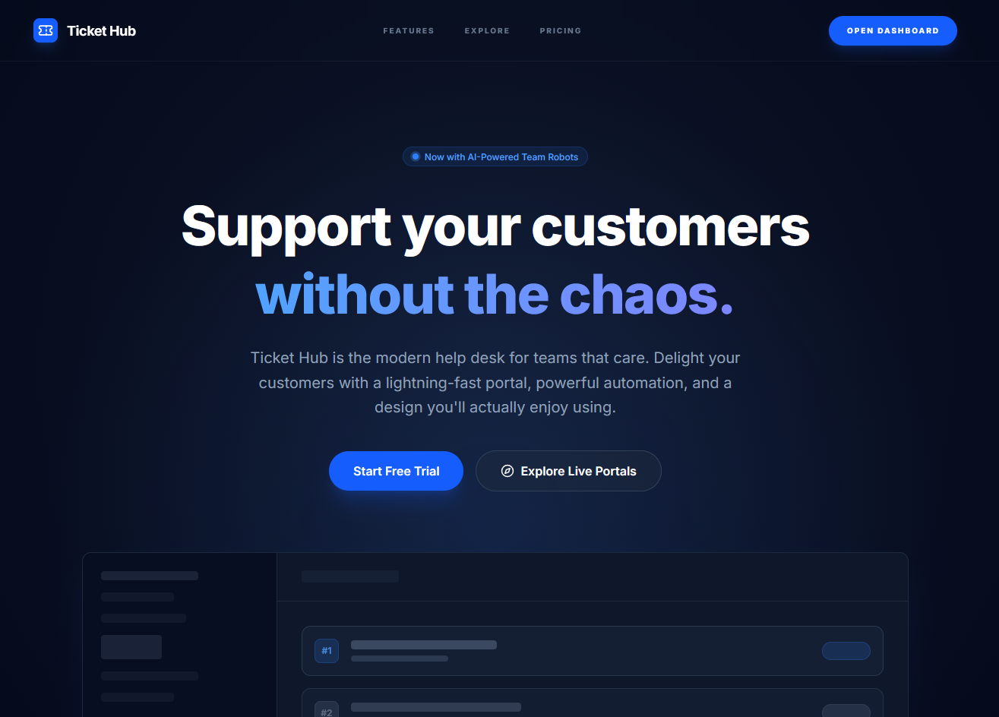

# Ticket Hub

> **Customer Support Reimagined.** Deliver client support with speed, transparency, and a design you'll actually enjoy using.

Ticket Hub is a modern, open-source help desk platform built for teams that value simplicity and productivity. It transforms the traditional, cluttered support experience into a streamlined interface designed with our unique "Deep Space Glass" system.



---

## Key Features

### ⚡ Ticket Management
Triage with precision. Use custom workflows, tags, and priorities to ensure no customer request ever slips through the cracks. Manage everything through a reactive, drag-and-drop Kanban board.

### 🌐 Public Customer Portals
Give your customers a branded, transparent home to submit requests and track progress. The portal is fully SEO-optimized and maintains the premium aesthetic of the admin panel.

### 🤖 Automation Robots
Automate everything. Our API-first architecture allows you to create and route tickets automatically, letting your team focus on high-value problems rather than data entry.

---

## Tech Stack

* **Backend:** [Laravel 12](https://laravel.com) running on [PHP 8](https://www.php.net/)
* **Styling:** [Tailwind CSS v4](https://tailwindcss.com)
* **Testing:** [Pest 4](https://pestphp.com)

---

## Installation

### Requirements
Ensure your environment meets the following prerequisites:
* PHP >= 8.2
* Composer
* Node.js & NPM

### Setup Steps

1. **Clone the repository**
    ```bash
    git clone [https://github.com/PMota173/ticket-hub.git](https://github.com/PMota173/ticket-hub.git)
    cd ticket-hub
    
    ```

2. **Install dependencies**
    ```bash
    composer install
    npm install
    
    ```


3. **Configure environment**
    ```bash
    cp .env.example .env
    php artisan key:generate
    
    ```


4. **Database setup**
    ```bash
    # Ensure your database credentials in .env are correct before running this
    php artisan migrate --seed
    
    ```


5. **Start development**
    ```bash
    php artisan serve
    npm run dev
    
    ```


---

## Contributing

Ticket Hub is an open-source project and we welcome contributions.

1. Fork the repo.
2. Create your feature branch (`git checkout -b feature/CoolFeature`).
3. Commit your changes (`git commit -m 'Add some CoolFeature'`).
4. Push to the branch (`git push origin feature/CoolFeature`).
5. Open a Pull Request.

---

## Support

If you find value in Ticket Hub, consider supporting its development:

* **Star this repository** to help others find it.
* **Sponsor on GitHub**: [github.com/PMota173](https://github.com/sponsors/PMota173)

---

## License

The Ticket Hub is open-sourced software licensed under the [MIT license](https://www.google.com/search?q=LICENSE).
