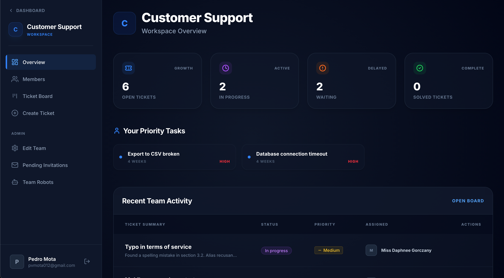

# Ticket Hub

[](https://tickethub.dev.br)
[](https://php.net)
[](https://laravel.com)
[](https://pestphp.com)
[](LICENSE)

> **Customer Support Reimagined.** Deliver client support with speed, transparency, and a design you'll actually enjoy using.

Ticket Hub is a modern, open-source, and self-hostable help desk platform built for teams that value simplicity, productivity, and an excellent user experience. 

---

## 📖 The Story Behind Ticket Hub

Traditional help desk software often feels bloated, slow, and overly complex for most teams. We wanted a solution that gets out of the way, focusing entirely on resolving customer issues quickly while maintaining a beautiful, intuitive interface. 

Ticket Hub was built to solve this exact problem. It strips away the unnecessary enterprise clutter and focuses on what truly matters: a drag-and-drop Kanban interface for the support team, and a seamless, transparent public portal for the end users. 

By making it **100% open-source and self-hostable**, you retain full ownership of your customer data without being locked into expensive per-agent pricing tiers. Whether you're a solo developer, a small agency, or an open-source maintainer, Ticket Hub scales with your needs.

---

## 📸 Screenshots

### Landing Page

*A sleek, modern public landing page to welcome your customers.*

### Team Dashboard

*Manage your entire support pipeline from a single, beautiful dashboard.*

### Reactive Kanban Board

*Drag and drop tickets through statuses seamlessly with our reactive Kanban interface.*

---

## ✨ Features

### For the Support Team
- **Reactive Kanban Board:** Triage and manage tickets with a drag-and-drop interface. Move tickets through statuses seamlessly.
- **Custom Tags & Priorities:** Categorize requests perfectly to ensure no high-priority issue ever slips through the cracks.
- **Team Collaboration:** Invite team members, assign specific roles, and work together on resolving customer issues.
- **Automation Robots:** Create API keys (Robots) to automatically ingest tickets from external sources, custom forms, or other applications.

### For the End Customer
- **Public Customer Portals:** Give your customers a branded, transparent home to submit requests and track their progress in real-time.
- **SEO-Optimized & Fast:** The portal is lightweight, fast, and maintains a premium aesthetic matching the admin panel.
- **Real-time Updates:** Customers can see comments, status changes, and priority updates as they happen.

---

## 🛠️ Tech Stack & Architecture

Ticket Hub is built on the shoulders of modern PHP giants, adhering strictly to **Test-Driven Development (TDD)** to ensure reliability.

- **Backend:** [Laravel 12](https://laravel.com) running on [PHP 8.2+](https://www.php.net/)
- **Frontend:** Blade Templates styled with [Tailwind CSS v4](https://tailwindcss.com)
- **Testing:** [Pest 4](https://pestphp.com). The project currently boasts **92 automated feature tests**, covering everything from permissions to API robots and team management.
- **Architecture:** We follow standard Laravel conventions heavily, utilizing Form Requests for validation, Policies for authorization, and standard Eloquent Models.

---

## 🚀 Installation & Self-Hosting

### Requirements
- PHP >= 8.2
- Composer
- Node.js & NPM
- SQLite, MySQL, or PostgreSQL

### Local Development Setup

1. **Clone the repository**
```bash
git clone https://github.com/PMota173/ticket-hub.git
cd ticket-hub
```

2. **Install dependencies**
```bash
composer install
npm install
```

3. **Configure the environment**
```bash
cp .env.example .env
php artisan key:generate
```

**Key `.env` Variables to Configure:**
- `APP_URL`: Set this to your local or production URL (e.g., `http://localhost:8000` or `https://tickethub.dev.br`).
- `DB_CONNECTION`: We recommend `sqlite` for local testing, but `mysql` or `pgsql` for production.
- `MAIL_MAILER`: Configure your SMTP credentials to ensure team invitations and ticket notifications are sent.

4. **Run migrations and seed the database**
```bash
php artisan migrate --seed
```

5. **Start the application**
```bash
php artisan serve
npm run dev
```

### Running the Tests
Ticket Hub is built with TDD in mind. You can run the full test suite easily using Pest:
```bash
php artisan test
```

### Production / Self-Hosting
Ticket Hub is a standard Laravel application. For production deployments, we recommend:
1. Provisioning a server with **Laravel Forge** or using Docker via **Laravel Sail**.
2. Setting `APP_ENV=production` and `APP_DEBUG=false`.
3. Ensuring your web server (Nginx/Apache) points to the `/public` directory.

---

## 🗺️ Roadmap

- [x] Ticket Management & Kanban Board
- [x] Public Customer Portals
- [x] Automation Robots (API ingestion)
- [x] Team Invitations & Role Management
- [ ] Email Pipeline Integration (Reply via Email)
- [ ] Knowledge Base / FAQ Section
- [ ] Webhook support for external notifications (Slack/Discord)

---

## 🤝 Contributing

Ticket Hub is an open-source project and we absolutely love community contributions! Whether it's a bug fix, a new feature, or a documentation improvement, your help makes Ticket Hub better for everyone.

1. Fork the repository.
2. Create your feature branch (`git checkout -b feature/AmazingFeature`).
3. Commit your changes (`git commit -m 'Add some AmazingFeature'`).
4. Push to the branch (`git push origin feature/AmazingFeature`).
5. Open a Pull Request.

Please ensure you run `php artisan test` and `vendor/bin/pint` before submitting your PR to maintain code quality.

---

## ❤️ Support & Sponsorship

If you find value in Ticket Hub, consider supporting its ongoing development. Your support helps cover hosting costs, domain renewals, and the energy to keep shipping new features.

* 🌟 **Star this repository** to help others find it!
* 💖 **Sponsor on GitHub**: [github.com/sponsors/PMota173](https://github.com/sponsors/PMota173)
